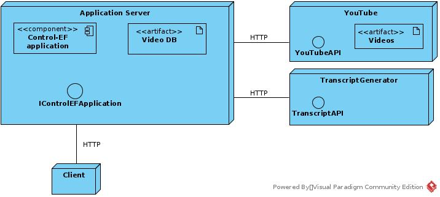
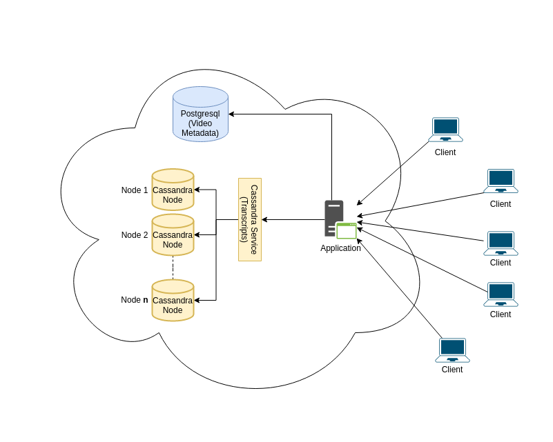
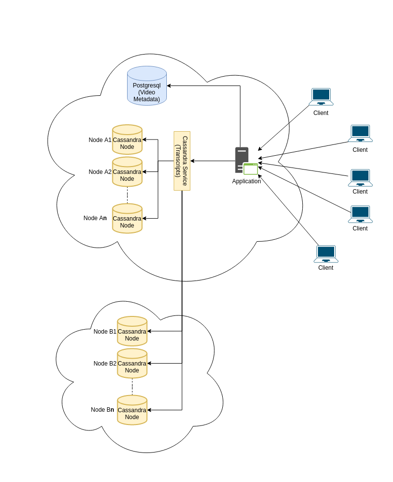
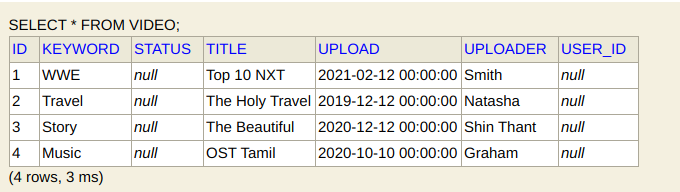
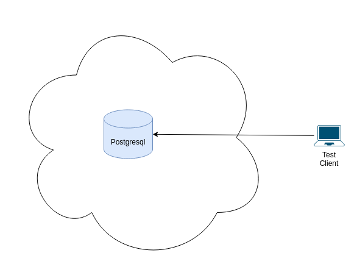
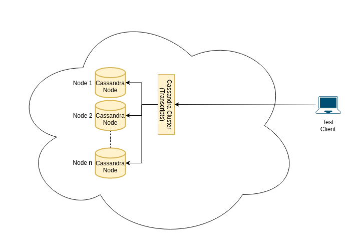

# Control-ef (Ctrl+F)

## Table of Contents

1. [Table of Contents](#Table-of-Contents)
1. [Team Members](#team-members)
1. [About the project](#about-the-project)
1. [Documentation](#documentation)
1. [Setting up the Database for Development](#Setting-up-the-Database-for-Development)
1. [Architecture](#architecture)
2. [Proposed Architecture](#proposed-Architecture)
3. [Quality Attribute Analysis](#quality-attribute-analysis)
4. [Team Responsibilites](#team-responsibilites)
5. [Meeting Schedule](#meeting-schedule)
6. [Timetable](#timetable)
7. [Dependencies](#dependencies)
8. [Team Responsibilites](#team-responsibilites)
9. [Design Pattern integration](#design-pattern-integration)
10. [Security](#security)
11. [Data Relationships](#data-relationships)
11. [Test Architecture](#test-architecture)
12. [Docker Integrations](#docker-integrations)
12. [Postgres Stress Testing Jmeter](#Postgres-Stress-Testing-Jmeter)
13. [Apache Cassandra Stress Test](#apache-cassandra-stress-test)

## Team Members

1. Fathima Shafana (121985)

2. Htoo Lwin (Leader) (120832)

## About the project

A platform where students can search any word or phrase they are interested in, and the search engine will retrieve video-lectures with exact timestamps when the phrase was said. The platform allows users to upload video and audio. After the upload, the platform generates a video specific transcript used for searching. The transcript may be edited by some users*.

## Documentation

All the documentation can be found in the [Documentation](/Documentation) folder for every phase.

1. [Kickoff](/Documentation/Kickoff)
2. [Progress](/Documentation/Progress)
3. [Testing](/Documentation/Testing)
4. [Final](/Documentation/Final)

**NOTE: The PDFs in the Testing folder are basically the same as in the Final folder**. The [test results](/Documentation/TestResults) for Cassandra are also included.

## Setting up the Database for Development

- Install postgreSQL

Enter these commands in terminal on Linux. If Windows, then equivalent commands can be found:

1. `sudo -u postgres createuser falcon`
2. `sudo -u postgres createdb controlefdb -O "falcon"`
3. `sudo -u postgres psql`
  
4. `psql=# alter user falcon with encrypted password '{PASSWORD}';`

5. `psql=# grant all privileges on database controlefdb to falcon`

## Architectural Patterns

1. Model-view-controller (MVC)
2. Service-oriented Architecture
3. P2P(?)

The ControlEF application will utilize the model-view-controller (MVC) architecture pattern in main as we will be using the MVC framework Spring Boot. The architecture regarding the YouTube and Transcription APIs will utilize microservices in the form of the aforementioned APIs themselves. It will also incorporate some best practices from service-oriented architecture (SOA). Proposed and test architecure uses P2P.

## Proposed Architecture

## Quality Attribute Analysis

| Quality Attribute | Priority | Reason |
| ----------- | ----------- | ----------- |
| **Availability** | H | The platform's main purpose is to provide aid in the learning process, so it should be available as much as possible. It should not fail the student when he needs it. |
| **Performance** | H | When a student is learning, it is important not to lose focus. So, the platform's search function should work as quickly as possible. |
| Portability | L | As the majority of quality studying is done in front of a desk, the software architecture should be designed for desktop computers (Windows PC, Mac OS). |
| Security | M | The main function - searching - only retrieves data, which is not dangerous. But uploading and transcript editing should be done only by authorized personnel. The software should provide that. |
| **Scalability** | H | As this platform is basically a database, any kind of expansion (most likely vertical) should be seamless and unnoticed by the user.
| Testability | M | The functionality is quite simple and input methods are limited. The upload formats (video and audio) are also limited. The only functionality that should be tested thoroughly is the transcript generation. |

## Team Responsibilites

| Module | Member |
| ----------- | ----------- |
| Web Application | Gleb Cirkov |
| Database | Htoo Lwin |
| Transcript Generator | Fathima Shafana |

## Meeting Schedule

Weekly - Fridays at 15.00 GMT+7.00.

**Note**: Will increase in regularity as workload increases.

Regular communication mechanism: Line.

Issue tracker: Trello

## Timetable

## Progress

Authentication 

YouTube Player 

Tag Search 

Transcript Search 

YouTube Upload  :disappointed:

YouTube Transcripts  :disappointed:

Database 

PostgreSQL Experimental Setup 

Cassandra Experimental Setup 

## Dependencies

1. H2 database
2. Spring Web
3. Spring DevTools
4. Lombok
5. JSTL
6. JPA
7. Tomcat jasper
8. Spring Security
9. Validation
10. Java Mail Sender

# Design Pattern integration

## Factory

This pattern defines an interface that is used to create an object and lets the subclasses decide which class to instantiate. The Factory Method lets a class defer instantiation to its subclasses. In the repository, different roles are created from the Role Factory having different access privileges such as Admin user who handles the administrative tasks of the application and the role registered user who are basically users who are registered to the application to use.

## Builder

The Builder pattern separates the construction of a complex object from its representation so that the same construction process can create different representations. This pattern is used in the project Control-Ef to create videos which consist of ID, title, keyword, date of upload and the uploader. Using the builder design pattern makes this process easier to create videos with many parameters. We are allowed to even leave out a few parameters and the order of parameters also does not matter here thus the builder pattern reduces the occurrence of errors as well. **In our case, the builder does not work as of yet because of some constructor conflicts with lombok. Namely, the default constructor that we supplied the Video class with overrides the all-argument constructor by lombok and when called the builder does not pass the correct values in anymore. We are currently working on a solution**.

## Singleton

The Singleton pattern ensures that a class has only one instance and provides a global point of access to that instance. The VideoService class is made a singleton via the @Component on declaration and is tested with JUnit tests. This DP may be dropped later as we are still debating the appropriateness of it. If not, we are sure we still use the singleton in the form of other annotations for the controllers, beans, etc.

## Facade

A facade DP is used to encapsulate all the workflow after a user uploads a video. This is done by the VideoService service class and is called directly in the VideoController. This is one way of doing the workflow and another way is the Chain of Responsibility below. This DP is closely tied in with the State DP as well. We think that this DP will be very useful in other features of the application as well. For now, the workflow only does simple printing, with no actual processing.

## Chain of Responsibility

The Chain of Responsibility pattern decouple the sender of a request to the receiver by giving more than one object a chance to handle a request. A chain of responsibility called VideoProcessingChain is used here to simulate the workflow of the user uploading a video. This is an alternative method to the Facade approach above, but we have a plan to combine both in our final implementation. There are two processes so far in the chain - the VideoUploader and the TranscriptGenerator. For now, the workflow only does simple printing, with no actual processing.

## Decorator

Decorator design pattern was implemented as a limited tag function. A user can input: a course tag, the degree of the course, the host (lecturer) and the activity type (lab/lecture/seminar). At the end this can be used for search and for a semi-automatic description of a video. The integration image serves as an example:
Tags are not mandatory. When used, the design pattern allows for some of the tags to be empty (not called). But the current implementation does not support that.

## State

State design pattern allows an object to alter its behavior when its internal state changes. The object will appear to change its class. The State design pattern was implemented as a dynamic video processing progress representation. In other words, a box that shows in which state of processing the video is currently at: preparation, upload, transcription, error or done.
There are 4 state classes. Each must proceed to another in a fixed order and cannot go down [stateUp()]. Each class also has an ability to report an error [errorEncountered()]. Each class can report its state [printState()].

---

## Security

Security (Auth&Auth) for this application is carried out via the built-in Spring Security. Only Admins can access the admin dashboard. When users access it, they are brought to an error page. It was originally designed to hide the admin dashboard button in the navbar but a problem occurred (see below).

Our original design was supposed to allow only logged in users to access the [homepage](http://localhost:8080) as well. However, due to some unknown bug, everyone can access the home page as well. Our config also defines the route matcher `antMatchers("/**").hasAnyRole("ADMIN","USER")` in the `SecurityConfig.java`. Any advice would be appreciated.

Users can register through the Registration form. After an email is sent to the Mailtrap email API.

Sample data for login:

1. username: admin, password: password
2. username: john, password: password

## Data Relationships

For now we only identified and implemented one relationship between the `User` entity and the `Video` Entity, in addition to the ManytoMany relationship between `Users` and `Roles` (as specified in Spring Security). Therefore `User` has a OnetoMany relationship with `Video`.

- A User (Admin or Lecturer role) can upload many videos.
- A Video has to be uploaded by a single User.

Other potential relationships:

- Video-Comment: OnetoMany

- Video-Tag: ManytoMany

## Test Architecture

## Docker Integrations

This contains on setting up all the containers for the experiment. Please see the [docker section](/docker) for more details.

## Postgres Stress Testing JMeter

[This](/JMeter) contains the `jmx` file for JMeter used in our stress test for postgres.

## Apache Cassandra Stress test

This contains everything related to the `cassandra-stress` tool. Please see the [cassandra section](/cassandra) for more details.

---
